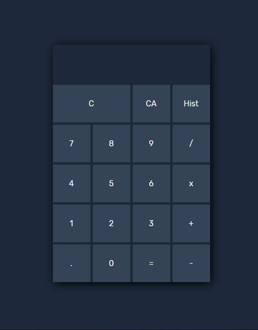
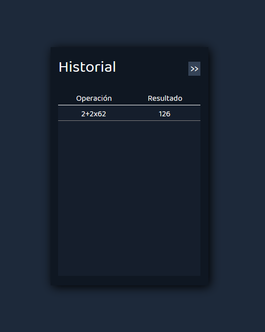

# Javascript Calculator

Una calculadora construida con HTML, CSS y Javascript a la cual se puede acceder desde el siguiente **[link](https://jcozores97.github.io/Calculator/)** sin necesidad de instalación.

## Descripción

Esta calculadora permite:

* Realizar operaciones artiméticas básicas con números enteros

* Realizar operaciones aritméticas basicas con números decimales

* Acceder al historial de las últimas 11 operaciones realizadas por el usuario durante la sesión

## Screenshots





## Desafios

* No utilizar durante el desarrollo la función ```eval()``` que provee javascript

## Uso

* Al presionar sobre cualquier botón numérico, se mostrará en el display el número presionado siempre y cuando al presionarlo no se exceda la cantidad máxima de caracteres permitidos en el display.

* Al presionar sobre un botón de operación, se mostrará en el display la operación seleccionada siempre y cuando el último caracter en el display no sea una operación o un punto decimal. Al mismo tiempo se comparte la restricción del item anterior respecto a la cantidad máxima de caracteres en el display.

* Al presionar el boton C se borrará el último caracter del display.

* Al presionar el boton CA se borrará todo el contenido del display.

* Al presionar el botón "=" se resolverá la operación y se mostrará en el display el resultado de la misma. Sobre ese resultado se podrá seguir operando.

* Las operaciones retornan "error" cuando el resultado de las mismas excede el máximo de caracteres permitidos en el display.

* Al presionar el botón "HIST" se dirigirá al usuario a la sección del historial.

* Al presionar sobre botón superior derecho del historial se retorna a la sección de la calculadora.